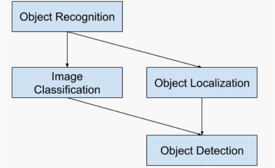

<h1> OVERVIEW </h1>
Object recognition is a general term to describe a collection of related computer vision tasks that involve identifying objects represeted as digital features.
 
<ul> <li> Image classification involves predicting the class of one object in an image. </li>
<li> Object localization refers to identifying the location of one or more objects in an image and drawing abounding box around their extent. </li>
<li> Object detection combines these two tasks and localizes and classifies one or more objects in an image. </li> </ul?
When a user or practitioner refers to “object recognition“, they often mean “object detection“.
   
... we will be using the term object recognition broadly to encompass both image classification (a task requiring an algorithm to determine what object classes are present in the image) as well as object detection (a task requiring an algorithm to localize all objects present in the image) ...   — ImageNet Large Scale Visual Recognition Challenge, 2015.
   
From this breakdown, we can see that object recognition refers to a suite of challenging computer vision tasks  
 
  

 
<h1> ABOUT THE DATA </h1>  
The data contains features extracted from the silhouette of vehicles in different angles. Four "Corgie" model vehicles were used for the experiment: a double decker bus, Cheverolet van, Saab 9000 and an Opel Manta 400 cars. This particular combination of vehicles was chosen with the expectation that the bus, van and either one of the cars would be readily distinguishable, but it would be more difficult to distinguish between the cars.
   
The images were acquired by a camera looking downwards at the model vehicle from a fixed angle of elevation (34.2 degrees to the horizontal). The vehicles were placed on a diffuse backlit surface (lightbox). The vehicles were painted matte black to minimise highlights. The images were captured using a CRS4000 framestore connected to a vax 750. All images were captured with a spatial resolution of 128x128 pixels quantised to 64 greylevels. These images were thresholded to produce binary vehicle silhouettes, negated (to comply with the processing requirements of BINATTS) and thereafter subjected to shrink-expand-expand-shrink HIPS modules to remove "salt and pepper" image noise.
   
The vehicles were rotated and their angle of orientation was measured using a radial graticule beneath the vehicle. 0 and 180 degrees corresponded to "head on" and "rear" views respectively while 90 and 270 corresponded to profiles in opposite directions. Two sets of 60 images, each set covering a full 360 degree rotation, were captured for each vehicle. The vehicle was rotated by a fixed angle between images. These datasets are known as e2 and e3 respectively.
   
A further two sets of images, e4 and e5, were captured with the camera at elevations of 37.5 degs and 30.8 degs respectively. These sets also contain 60 images per vehicle apart from e4.van which contains only 46 owing to the difficulty of containing the van in the image at some orientations.
 
  <ol><li>COMPACTNESS (average perim)**2/area </li>
<li> CIRCULARITY (average radius)**2/area </li>
<li> DISTANCE CIRCULARITY area/(av.distance from border)**2 </li>
<li> RADIUS RATIO (max.rad-min.rad)/av.radius </li>
<li> PR.AXIS ASPECT RATIO (minor axis)/(major axis) </li>
<li> MAX.LENGTH ASPECT RATIO (length perp. max length)/(max length) </li>
<li> SCATTER RATIO (inertia about minor axis)/(inertia about major axis) </li>
<li> ELONGATEDNESS area/(shrink width)**2 </li>
<li> PR.AXIS RECTANGULARITY area/(pr.axis length*pr.axis width) </li>
<li> MAX.LENGTH RECTANGULARITY area/(max.length*length perp. to this). </li>
<li> SCALED VARIANCE (2nd order moment about minor axis)/area ALONG MAJOR AXIS </li>
<li> SCALED VARIANCE (2nd order moment about major axis)/area ALONG MINOR AXIS </li>
<li> SCALED RADIUS OF GYRATION (mavar+mivar)/area </li>
<li> SKEWNESS ABOUT (3rd order moment about major axis)/sigma_min**3 MAJOR AXIS </li>
<li> KURTOSIS ABOUT (4th order moment about major axis)/sigma_min**4 MINOR AXIS </li>
<li> KURTOSIS ABOUT (4th order moment about minor axis)/sigma_maj**4MAJOR AXIS </li>
    <li> HOLLOWS RATIO (area of hollows)/(area of bounding polygon) </li></ol>  
Where sigma_maj2 is the variance along the major axis and sigma_min2 is the variance along the minor axis, and
area of hollows= area of bounding poly-area of object
 
The area of the bounding polygon is found as a side result of the computation to find the maximum length. Each individual length computation yields a pair of calipers to the object orientated at every 5 degrees. The object is propagated into an image containing the union of these calipers to obtain an image of the bounding polygon.
  
NUMBER OF CLASSES 4 OPEL, SAAB, BUS, VAN
