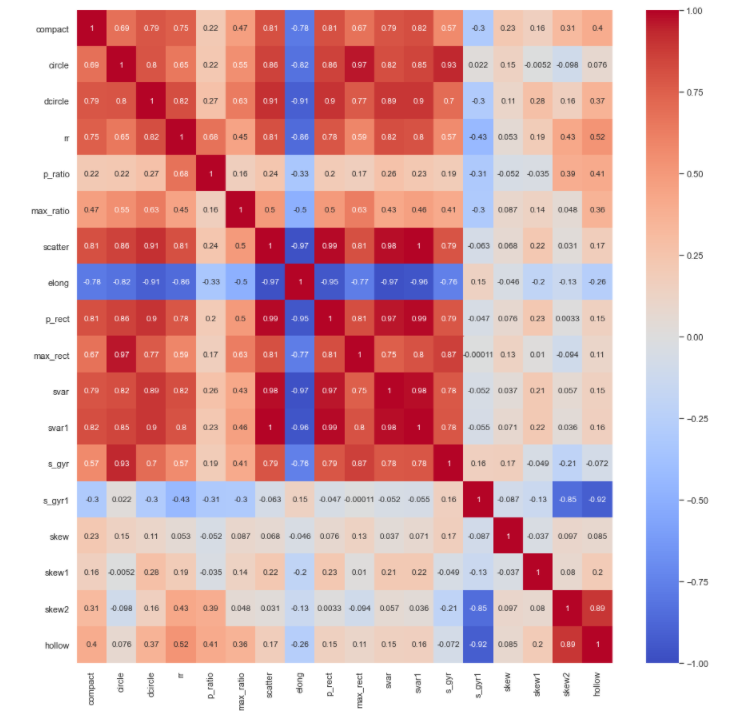

# AI-ML-Projects
Projects completed in Artificial Intelligence and Machine Learning undertaken as Freelancing Opportunities.
## Project Done
### 1. Data Visualization of Customer health records
* Covers Descriptive Statistics, Probability & Conditional Probability, Hypothesis Testing, Inferential Statistics, Probability Distributions, Types of distribution and Binomial, Poisson & Normal distribution.

    * **Project link:** [Health Insurance Data Visualization](https://github.com/vvenkatac/AI-ML-Projects/tree/main/Customer%20Health%20Insurance%20Analaysis)  

      * This project used Hypothesis Testing and Visualization to leverage customer's health information like smoking habits, bmi, age, and gender for checking statistical     evidence to make valuable decisions of insurance business like charges for health insurance.
      * 3Ms and Distribution of BMI
      * 3Ms and Distribution of Charges
      * Distribution of Charges by # of Children
      * Distribution of BMI of Female with # Children
      
### 2. Classification techniques for Customer Loan Data Segmentation
* Covers Multiple Variable Linear regression, Logistic regression, Naive Bayes classifiers, Multiple regression, K-NN classification, Support vector machines

    * **Project link:** [Customer Loan Data Segmentation](https://github.com/vvenkatac/AI-ML-Projects/tree/main/Bank%20Customer%20Data%20Classificiation)
    
         *Identified potential loan customers for Thera Bank using classification techniques. Compared models built with Logistic Regression and KNN algorithm in order to select   the best performing one.
         * ***Personal Loan vs Income***
         * ***Model Accuracy Scores Comparison***  
         
         
### 3. Classification and Ensemble techniques for Customer Term Deposit prediction
* Covers Multiple Variable Linear regression, Logistic regression, Naive Bayes classifiers, Multiple regression, K-NN classification, Support vector machines

    * **Project link:** [Ensemble Techniques](https://github.com/vvenkatac/AI-ML-Projects/tree/main/03_Ensemble_Techniques)
    
         * Leveraged customer information of bank marketing campaigns to predict whether a customer will subscribe to term deposit or not. Different classification algorithms like Decision tree, Logistic Regression were used. Ensemble techniques like Random forest were used to further improve the classification results.
         * ***Decision Tree*** 
         * ***SVM*** 
         * ***Metaclassifier Technique*** 
         * ***Model Accuracy Scores Comparison***  
         
         
### 4. Classification techniques for vehicles from silhouette data
* Covers Training a SVM on raw data, performing a k-fold cross-validation, exracting principal components, training SVM on principal components, model comparisons 

    * **Project link:** [Unsupervised Machine Learning](https://github.com/vvenkatac/AI-ML-Projects/tree/main/04_Unsupervised_Learning)
         
         * Leveraged silhouette vehicle data to  classify a given silhouette as one of three types of vehicle, using a set of features extracted from the silhouette. The vehicle may be viewed from one of many different angles. Principal Component Analysis and K-fold cross validation techniques were used.
         * ***Correlation Analysis***
         * ***SVM*** 
         * ***PCA*** 
         * ***K-fold cross-validation***  
         
         
 ### 5. Predicting strength and performance of Concrete mix
* Covers Training a SVM on raw data, performing a k-fold cross-validation, exracting principal components, training SVM on principal components, model comparisons 

    * **Project link:** [Feature Engineering](https://github.com/vvenkatac/AI-ML-Projects/tree/main/05_Featurization%2C%20Model%20Selection%20%26%20Tuning)
         
         * Leveraged concrete mix data to build a ML model to predict the strength of high performance concrete mix. Feature Engineering is used to determine the optimal set of concrete data features and Regression models such as Decision Trees and Random Forest techniques are used in the  modeling. 
         * ***Data Analysis***  
           
         * ***Decision Trees***
         * ***Random Gorest***
         * ***Feature Engineering*** 
         * ***Model Comparison***  
          
 
### 6. Recommending top 10 products for an e-commerce platform 
* Covers Introduction to Recommendation systems, Popularity based model, Hybrid models, Content based recommendation system, Collaborative filtering (User similarity & Item similarity)

     * **Project link:** [Recommendation Systems](https://github.com/vvenkatac/AI-ML-Projects/tree/main/06_Recommendation_Systems)
      
         * Project involved building recommendation systems for Amazon products. A popularity-based model and a collaborative filtering filtering models were used and evaluated to recommend top-10 product for a user.
         * ***Summary*** 
                
         
### 7. Neural Networks
* Covers Displaying images frm the dataset, One hot Encoding, Neural Network Architecture, SGD Optimization, Adam Optimization, Visualizations of predictions  

     * **Project link:** [Neural Networks](https://github.com/vvenkatac/AI-ML-Projects/tree/main/07_Neural%20Networks)
      
         * Project involved reading data from h5py file, normalizing the train/test data, One hot encoding the labels, NN architecure definition using TensorFlow and activation functions, Hyper parameter tuning, Activation and Loss Functions.
         * ***NN archietcure***
         * ***One hot encoding labels***
         * ***TensorFlow***
         * ***ReLu and Softmax***
         * ***SGD and Adam Optimization***
         * ***Visualizing image data***  
                

### 8. Computer Vision 
* Covers Introduction to Convolutional Neural Networks, Convolution, Pooling, Padding & its mechanisms, Transfer Learning, Forward propagation & Backpropagation for CNNs, CNN architectures like AlexNet, VGGNet.

   * **Project link:** [Computer Vision](https://github.com/vvenkatac/AI-ML-Projects/tree/main/08_Computer%20Vision)
   
      * Project involved reading data from h5py file, normalizing the train/test data, One hot encoding the labels, NN architecure definition using TensorFlow and activation functions, Hyper parameter tuning, Activation and Loss Functions.
      * ***Image***  
         
      
      * ***Face Detected(with Mask)***   
         
      
      * ***Face & Mask***  
      
         
### 9. Advanced Computer Vision 
* Covers Face Recognition usign Aligned Face Dataset, VGG Network Model, Dimensionality Reduction using PCA and a SVM Classifier.

   * **Project link:** [Face Recognition](https://github.com/vvenkatac/AI-ML-Projects/tree/main/09_Advanced%20Computer%20Vision)
   
      * Face recognition deals with Computer Vision a discipline of Artificial Intelligence and uses techniques of image processing and deep learning. The objective of this project is to build a face recognition system, which includes building a face detector to locate the position of a face in an image and a face identification model to recognize whose face it is by matching it to the existing database of faces.
      * Aligned Faces Dataset from Pinterest (10k+ images of 100 celebs) - Face recognition model recognises similar faces with an accuracy of 97% and F1 score of 96%.
      * ***Faces Identified - Results***  
      

### 10. NLP Sentiment Analaysis
* Covers Bag of Words Model, POS Tagging, Tokenization, Word Vectorizer, TF-IDF, Named Entity Recognition, Stop Words

   * **Project link:** [NLP Sentiment Analysis](https://github.com/vvenkatac/AI-ML-Projects/tree/main/10_NLP_Sentiment_Analysis)

      * The objective of this project is to build a text classification model that analyses the customer's sentiments based on their reviews in the IMDB database. The model uses a complex deep learning model to build an embedding layer followed by a classification algorithm to analyze the sentiment of the customers.
      * ***Model***  
      
     
      * ***Results***  
      
 
### 11. NLP Sarcasm Detection
* Covers Introduction to Sequential data, Vanishing & Exploding gradients in RNNs, LSTMs, GRUs (Gated recurrent unit), Case study: Sentiment analysis, RNNs and its mechanisms, Time series analysis, LSTMs with attention mechanism, Case study: Machine Translation

   * **Project link**: [NLP Sarcasm Detection](https://github.com/vvenkatac/AI-ML-Projects/tree/main/11_NLP_Sarcasm_Detection) 
   
      * The goal of this hands-on project is to analyse the headlines of the articles from news sources and detect whether they are sarcastic or not. 
      
      * ***Display a Wordcloud of Sarcastic and Non-Sarcastic words***
       
      
      * ***Build a NLP Sequential Model***  
      
      
      * ***Display Confusion Matrix***  
      

      * ***Evaluate model***        
      
